# OCR 엔진 비교 실습 보고서

## 1. 서론

### 1.1 기존 OCR 평가의 한계

기존의 OCR 테스트는 주로 이미지에서 텍스트를 얼마나 정확하게 추출하는지를 평가하는 데 초점이 맞춰져 있었습니다. 글자 단위 정확도(Character Accuracy)나 단어 단위 정확도(Word Accuracy)를 기준으로 성능을 판단하며, 인식률이 높을수록 성능이 우수하다고 간주해왔습니다.

그러나 이러한 평가 방식에는 명확한 한계가 있다는 것을 확인하게 되었습니다. 텍스트 자체는 높은 정확도로 추출되었음에도 불구하고, 해당 데이터를 실제로 활용하려는 단계에서 다양한 문제가 발생했습니다. 표의 행과 열 구조가 깨지거나, 항목명과 값의 연결 관계가 분리되거나, 제목과 본문이 뒤섞이는 문제가 나타났습니다. 텍스트는 "읽힌 것처럼 보이지만", 실제로는 "활용할 수 없는 상태"로 출력되는 경우가 많았습니다.

### 1.2 왜 구조 보존이 중요한가

이 문제의 근본 원인은 문서를 단순한 텍스트의 집합으로 바라본 데 있습니다. 실제 문서는 단순한 문자열이 아니라, 다양한 요소 간의 관계로 구성된 구조적 정보입니다. 제목과 본문, 항목명과 값, 표의 열과 데이터는 각각 의미를 가지는 관계로 연결되어 있으며, 이러한 관계가 유지되어야만 문서의 의미가 온전히 전달됩니다.

예를 들어, 영수증에서 "A3리필속지", "1,300", "2", "2,600"이라는 글자를 따로 뽑아오는 것과, 이 값들이 "상품명 - 단가 - 수량 - 합계"라는 관계 안에서 묶여서 나오는 것은 완전히 다른 수준의 결과입니다. 전자는 그냥 글자 나열이고, 후자는 바로 데이터로 활용할 수 있는 상태입니다.

이러한 구조 손실 문제는 단순한 품질 저하를 넘어, 이후 시스템 전반에 영향을 미칩니다. RAG 기반 질의응답에서는 동일한 숫자라도 어떤 항목에 속하는지 알 수 없으면 잘못된 답변을 생성하게 되고, key-value 구조가 무너지면 데이터베이스 적재나 자동화 처리가 불가능해집니다. OCR은 데이터 파이프라인의 시작점이기 때문에, 이 단계에서 구조가 깨지면 이후 모든 단계에 비용과 오류가 누적됩니다.

### 1.3 테스트 목적

이에 따라 이번 테스트는 기존의 텍스트 정확도 중심 평가에서 벗어나, 두 가지 관점에서 OCR 성능을 검증하는 것을 목표로 합니다.

1. **텍스트 추출 정확도** — 이미지에서 글자를 얼마나 정확하게 읽어오는가
2. **구조 보존 능력** — 표의 행/열, 항목과 값의 관계가 유지되는가

단순히 "얼마나 많은 텍스트를 정확하게 읽었는가"가 아니라, **"읽은 정보가 원본 문서의 구조와 관계를 얼마나 잘 유지하고 있는가"**를 함께 평가하고자 합니다.

---

## 2. 실험 설계

### 2.1 비교 대상

오픈소스 엔진 1개와 클라우드 API 4개, 총 5개의 OCR 엔진을 비교했습니다.

| 엔진 | 유형 | 한국어 지원 |
|------|------|:-----------:|
| Tesseract | 로컬 (오픈소스) | O |
| Upstage Document AI | 클라우드 API | O |
| Amazon Textract | 클라우드 API (AWS) | △ (영문 위주) |
| Azure Document Intelligence | 클라우드 API (Azure) | O |
| Google Cloud Vision | 클라우드 API (GCP) | O |

### 2.2 테스트 문서 유형

2가지 종류의 문서를 영어/한국어 버전으로 각각 준비하여, 5개 엔진 x 4개 문서 = 총 20번의 테스트를 수행했습니다.

| 유형 | 한국어 | 영어 | 선정 이유 |
|------|:------:|:----:|-----------|
| 일반 텍스트 | ✓ | ✓ | 순수 문자 인식 능력의 기준점 |
| 표 (Table) | ✓ | ✓ | 구조 보존 능력의 핵심 테스트 |

테스트는 단계적으로 설계했습니다. 먼저 일반 텍스트로 기본 인식 성능을 확인한 뒤, 표를 통해 구조 보존 능력을 검증하는 순서입니다.

---

## 3. 실험 결과

### 3.1 일반 텍스트 — "글자를 읽는 것 자체는 기대 이상입니다"

먼저 가장 기본적인 테스트로, 단순한 텍스트 문서를 각 엔진에 넣어보았습니다.

#### 영어 문서

영어 문서에서는 5개 엔진 모두 기대 이상의 결과를 보여주었습니다. 특히 오픈소스인 Tesseract의 성능이 인상적이었는데, 클라우드 API와 비교해도 텍스트 정확도에서 체감할 수 있는 차이가 거의 없었습니다. 노이즈가 없고 단순한 텍스트 구조라면 굳이 유료 클라우드 API를 쓸 필요가 없을 정도였습니다.

| Tesseract | Upstage |
|:---------:|:-------:|
| 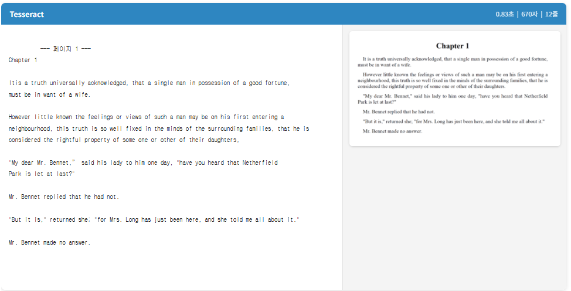 | 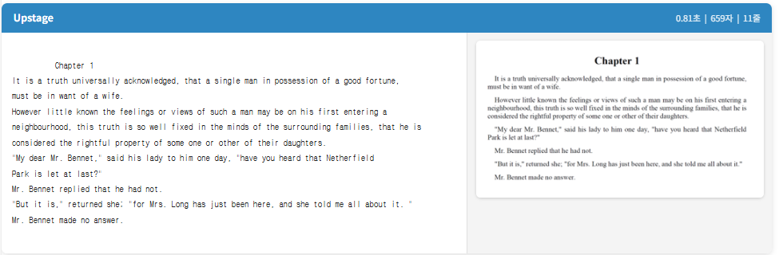 |

| Amazon Textract | Azure Document Intelligence | Google Cloud Vision |
|:---------------:|:---------------------------:|:-------------------:|
| 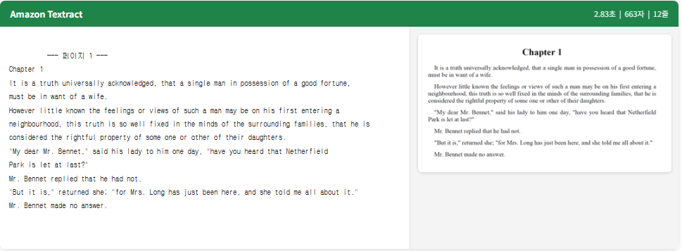 | 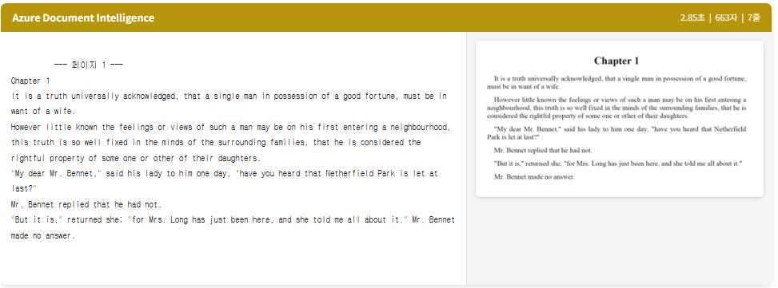 | 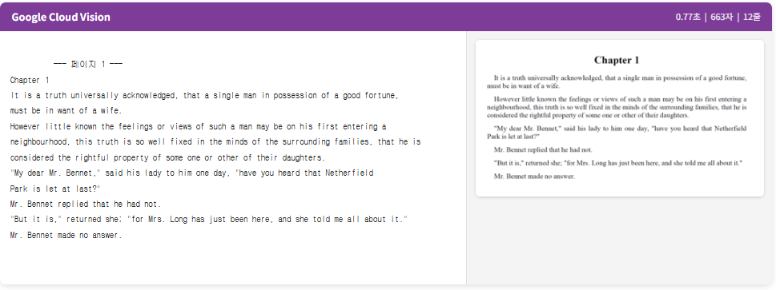 |

#### 한국어 문서

한국어 문서에서도 전체적으로 성능은 양호했으며, 여기서도 오픈소스 Tesseract가 기대 이상의 결과를 보여준 점이 눈에 띄었습니다. 다만 엔진별로 흥미로운 특성 차이가 나타났습니다.

**Amazon Textract**는 한국어를 공식 지원하지 않아서, 한글을 의미 없는 로마자와 숫자 조합으로 변환하여 출력했습니다. 원문과 전혀 관련 없는 결과가 나왔기 때문에 한국어 문서에서는 사실상 사용할 수 없는 수준이었습니다.

**Azure Document Intelligence**는 한국어 인식 자체는 정확했으며, 두 가지 눈에 띄는 특성을 보여주었습니다. 첫째, 줄바꿈 처리 방식에서 다른 엔진들과 뚜렷한 차이가 있었습니다. 원본 문서의 물리적 줄바꿈을 그대로 따르지 않고, 문장 단위로 텍스트를 이어 붙여 출력하는 경향이 있었습니다. 결과적으로 다른 엔진 대비 줄 수가 현저히 적었는데(9줄 vs 다른 엔진 30줄 이상), 이는 Azure가 단순 텍스트 추출이 아닌 문단 수준의 레이아웃 재구성을 수행하고 있음을 보여줍니다. 둘째, 원문에 포함된 한자(東光學校 등)까지 정확하게 인식해낸 점이 돋보였습니다. 다른 엔진들이 한자를 깨뜨리거나 누락하는 경우가 있었던 것과 비교하면, 다국어·다문자 혼합 문서에서 Azure의 강점이 드러나는 부분이었습니다.

| Tesseract | Upstage |
|:---------:|:-------:|
| 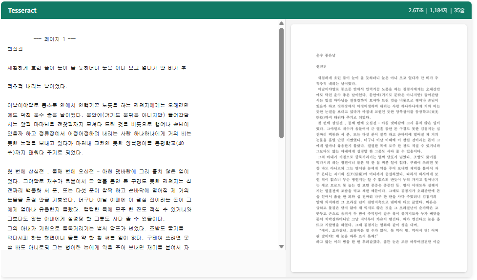 | 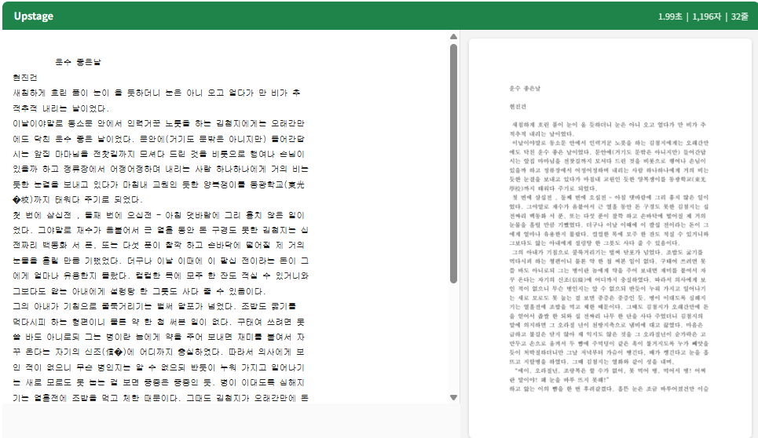 |

| Amazon Textract | Azure Document Intelligence | Google Cloud Vision |
|:---------------:|:---------------------------:|:-------------------:|
| 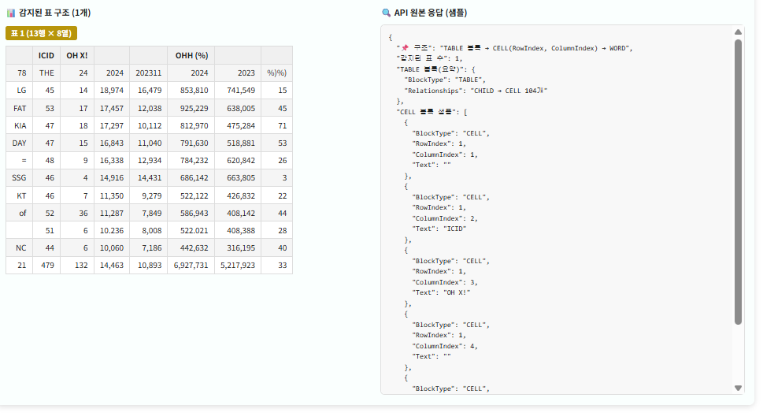 | 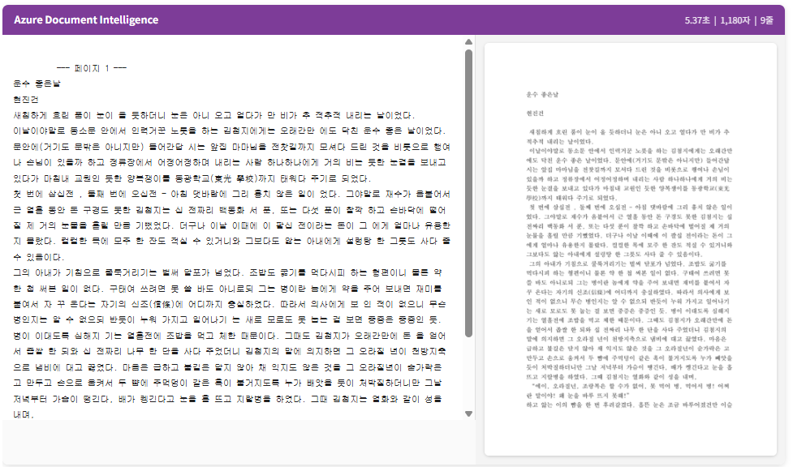 | 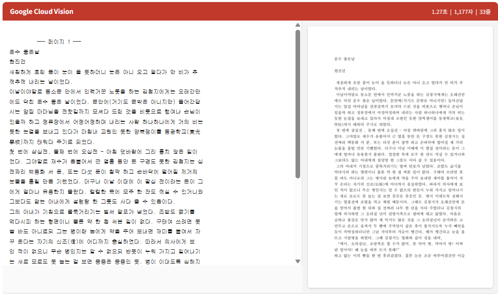 |

#### 소결

이 단계에서 느낀 점은, **단순히 이미지의 글자를 텍스트로 변환하는 것만 놓고 보면 오픈소스도 충분히 쓸 만하다**는 것이었습니다. Tesseract는 속도와 정확도 모두에서 유료 API에 뒤지지 않는 결과를 보여주었고, 클라우드 API 간에도 한국어 지원 범위(Amazon), 줄바꿈 보정 및 한자 인식(Azure) 등에서 각기 다른 특성을 확인할 수 있었습니다.

### 3.2 표 (Table) — "구조가 필요한 순간, 차이가 벌어집니다"

이번 실습에서 가장 관심이 있었던 부분입니다. 단순히 글자를 잘 읽는 것은 3.1에서 확인했으니, 이번에는 한 단계 더 나아가 **표의 행/열 구조나 항목-값의 관계가 유지되는지**를 확인해보았습니다.

테스트에 앞서, 각 엔진이 제공하는 **표 구조 인식 옵션**을 최대한 활용했습니다.

| 엔진 | 표 구조 인식 옵션 |
|------|-------------------|
| Tesseract | 없음 (단순 텍스트 추출만 지원) |
| Upstage | 별도 옵션 없이 기본적으로 레이아웃 구조 보존 |
| Amazon Textract | `analyze_document` + `FeatureTypes=['TABLES']` — 셀 단위 행/열 추출 |
| Azure Document Intelligence | `prebuilt-layout` 모델 — 테이블 셀 단위 행/열 추출 |
| Google Cloud Vision | 없음 (표 구조 인식은 별도 제품인 Document AI 필요) |

즉, Amazon Textract와 Azure는 **표 전용 모드를 켠 상태**에서 테스트했고, Tesseract와 Google Cloud Vision은 표 구조 옵션 자체가 없어 기본 모드로 진행했습니다.

#### 영어 표

표 구조 옵션이 없는 **Tesseract**와 **Google Cloud Vision**은 팀명과 숫자가 뒤섞이거나 개별로 나열되어, 행/열 관계를 복원할 수 없는 결과를 보여주었습니다.

반면 표 전용 모드를 제공하는 엔진들은 확연히 다른 결과를 보여주었습니다.

**Amazon Textract**는 TABLES 모드를 활성화하자 결과가 크게 달라졌습니다. 셀 단위로 `RowIndex`/`ColumnIndex`가 정확히 매핑되어, 팀명-승-패-승률 등의 관계가 완벽하게 보존된 구조화된 결과를 출력했습니다. 테스트한 엔진 중 **표 구조 인식 정확도가 가장 높았습니다.** 다만 한국어를 지원하지 않는다는 근본적 한계 때문에 영문 문서에서만 활용할 수 있다는 점이 아쉬웠습니다.

**Azure Document Intelligence**는 `prebuilt-layout` 모델로 전환하여 테이블 구조 인식을 시도했습니다. 셀 단위 `rowIndex`/`columnIndex` 정보를 반환했으며, Amazon Textract만큼은 아니지만 괜찮은 수준의 구조 인식 성능을 보여주었습니다.

**Upstage**는 다른 엔진들과는 접근 방식이 달랐습니다. 셀 좌표 정보를 반환하는 것이 아니라, **텍스트 자체가 행 단위로 정렬**되어 반환되는 특징을 보였습니다. "NY Yankees y 99 63 .611 5-5 L2 807 567 +240..."처럼 팀명과 모든 통계 수치가 하나의 행 안에 묶여 출력되었습니다. 별도 옵션 없이 기본 모드에서 동작하며, 셀 좌표 파싱 같은 후처리 없이 바로 읽을 수 있다는 점이 장점이었습니다.

| Tesseract | Upstage |
|:---------:|:-------:|
| 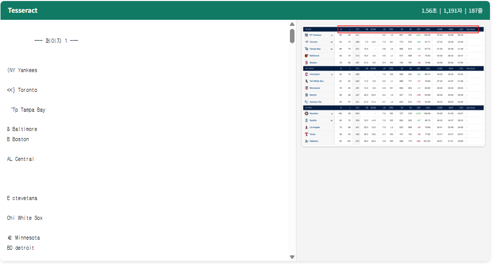 | 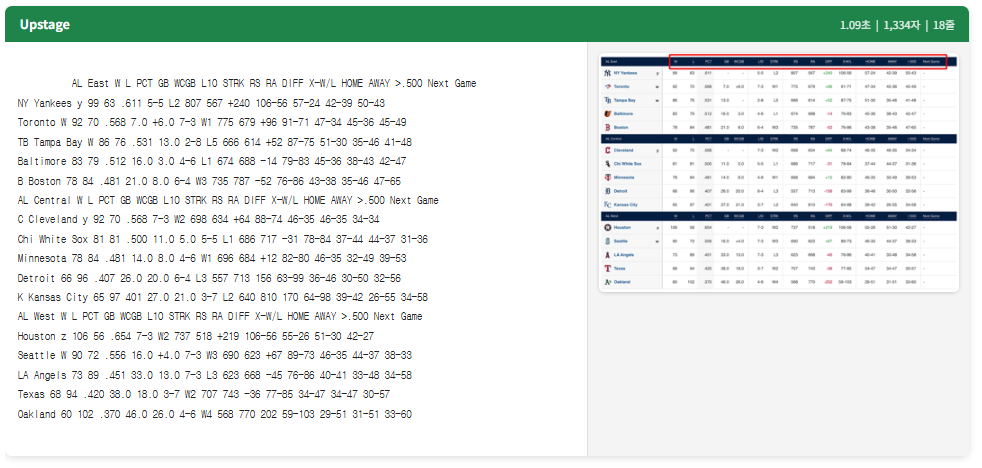 |

| Amazon Textract | Azure Document Intelligence | Google Cloud Vision |
|:---------------:|:---------------------------:|:-------------------:|
| 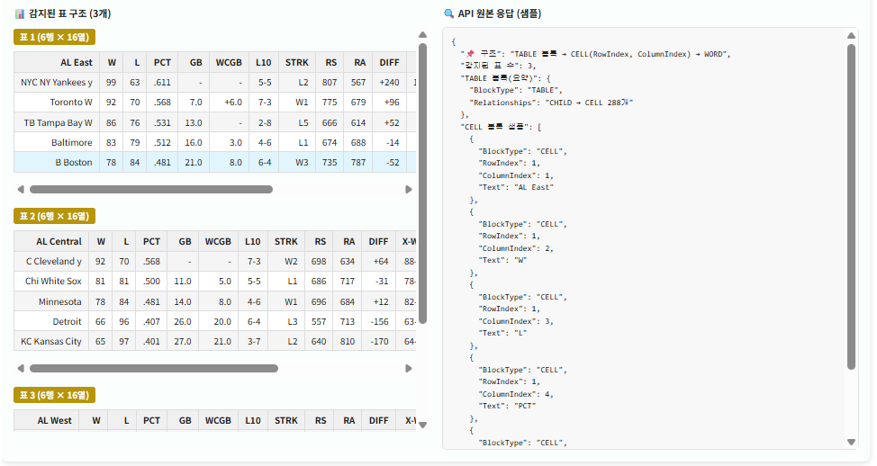 | 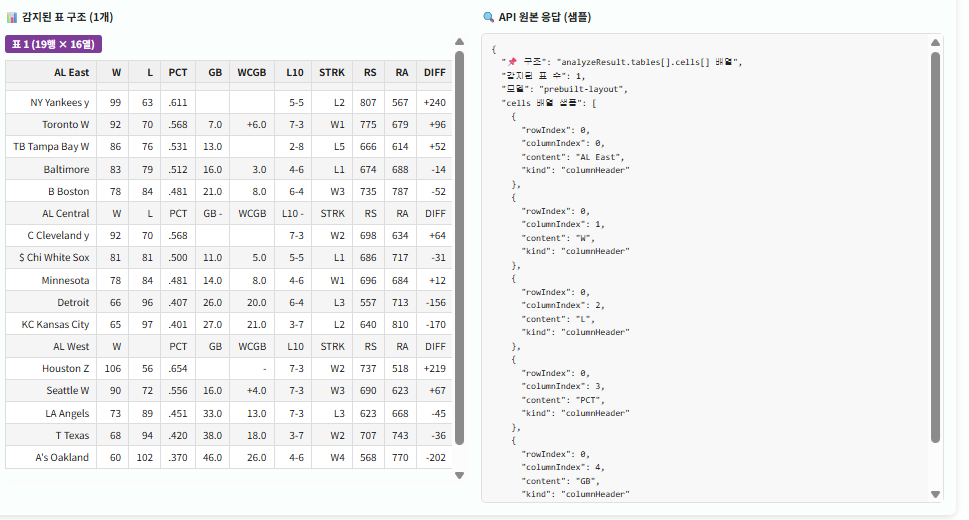 | 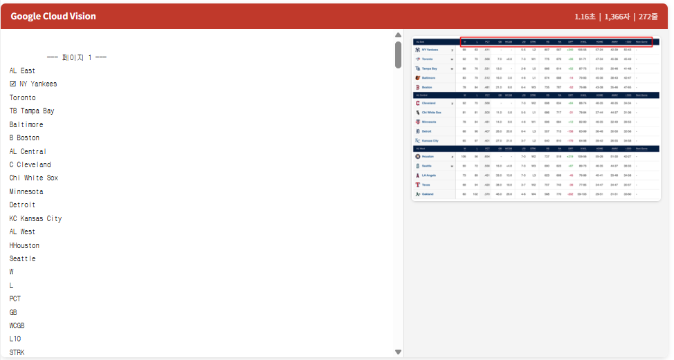 |

#### 한국어 표

한국어 표에서는 엔진 간 격차가 더욱 극명하게 드러났습니다.

**Tesseract**는 구단명과 숫자를 일부 인식했지만 열 정렬이 무너져 값의 대응 관계를 알 수 없었습니다. **Google Cloud Vision** 역시 한글 자체는 읽어냈지만, 헤더와 데이터 값이 개별로 출력되어 구조를 파악할 수 없었습니다.

**Amazon Textract**는 영어 표에서 가장 뛰어난 구조 인식을 보여주었음에도 불구하고, 한국어 표에서는 한글을 전혀 인식하지 못했습니다. TABLES 모드로 셀 경계는 감지했지만 한글 내용이 깨져서, 구조와 내용 모두 사용 불가능한 상태였습니다. **표 인식 기술 자체는 최고 수준이지만 한국어 미지원이라는 한계가 그대로 적용**되는 결과였습니다.

**Azure Document Intelligence**는 `prebuilt-layout`으로 한국어 표의 구조를 높은 정확도로 인식했습니다. 셀 단위 행/열 정보가 정확히 매핑되었으며, 한국어를 지원하면서도 표 구조까지 잘 보존한다는 점에서 실용적인 선택지였습니다.

**Upstage**는 한국어 표에서도 "LG 45 14 18,974 16,479 853,810 741,549 15"처럼 **각 구단의 데이터를 한 행으로 유지**하여 구조가 보존된 결과를 출력했습니다. 영어와 마찬가지로 별도 옵션 없이 기본 모드에서 행 단위 정렬이 유지되는 특징을 보여주었습니다.

| Tesseract | Upstage |
|:---------:|:-------:|
| 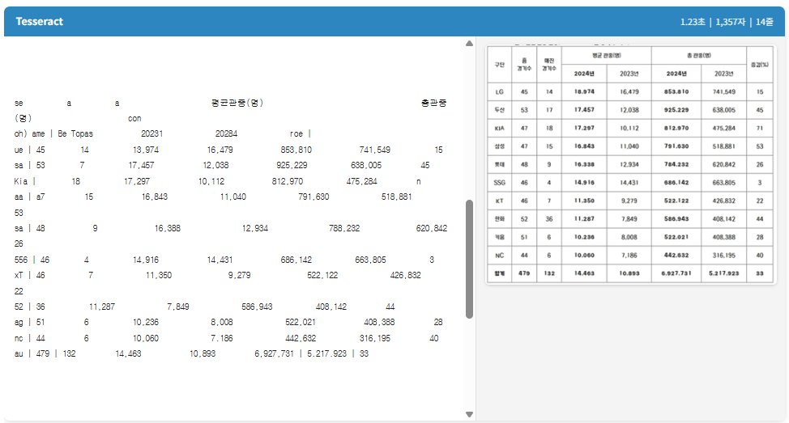 | 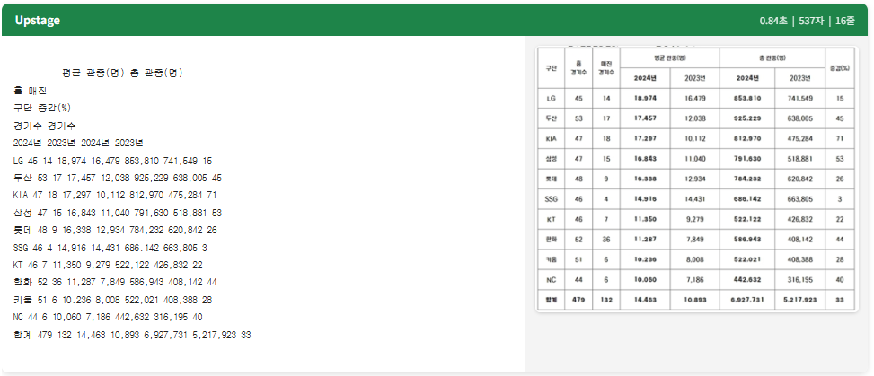 |

| Amazon Textract | Azure Document Intelligence | Google Cloud Vision |
|:---------------:|:---------------------------:|:-------------------:|
| 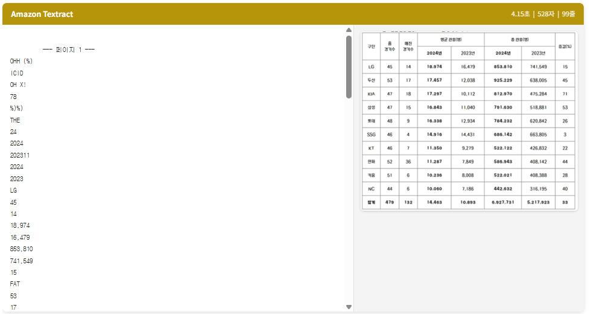 | 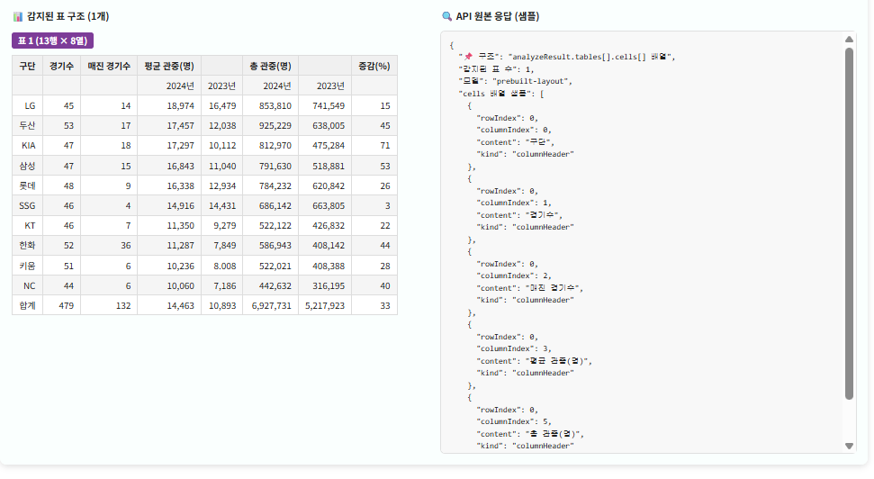 | 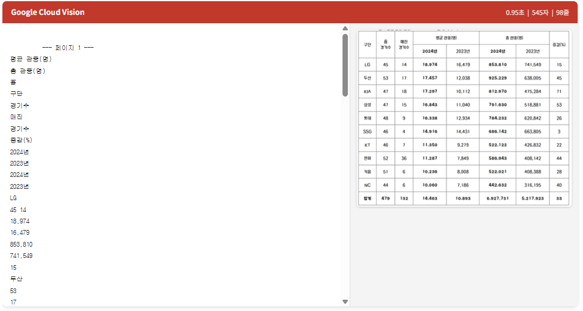 |

#### 소결

각 엔진의 표 구조 인식 결과를 정리하면 다음과 같습니다.

| 엔진 | 영어 표 | 한국어 표 | 응답 방식 |
|------|:-------:|:--------:|-----------|
| **Amazon Textract** | ⭐ 최고 | ✗ 한글 불가 | 셀 단위 좌표 (`RowIndex`/`ColumnIndex`) |
| **Azure** | ○ 양호 | ○ 양호 | 셀 단위 좌표 (`rowIndex`/`columnIndex`) |
| **Upstage** | ○ 양호 | ○ 양호 | 행 단위 텍스트 정렬 (좌표 없음) |
| Tesseract | ✗ 구조 소실 | ✗ 구조 소실 | 표 옵션 없음 |
| Google Cloud Vision | ✗ 구조 소실 | ✗ 구조 소실 | 표 옵션 없음 |

**Amazon Textract**는 표 구조 인식 정확도가 가장 높았지만, 한국어를 지원하지 않는다는 근본적 한계가 있었습니다. **Azure**는 한국어 표에서도 높은 정확도로 구조를 인식하여, 한국어를 지원하면서도 표 구조까지 잘 보존하는 실용적인 선택지였습니다. **Upstage**는 셀 좌표를 반환하는 대신 텍스트 자체를 행 단위로 정렬하여 반환하는 독특한 방식으로, 별도 옵션이나 후처리 없이도 구조가 보존된다는 점이 차별점이었습니다.

---

## 4. 결론

| 테스트 | 결과 |
|--------|------|
| 영어 일반 텍스트 | 전 엔진 양호, 오픈소스도 충분한 수준 |
| 한국어 일반 텍스트 | 대체로 양호, Amazon Textract만 한국어 호환 불가 |
| 영어 표 (구조 보존) | **Amazon Textract 최고 성능**, Azure 양호, Upstage 행 단위 보존 |
| 한국어 표 (구조 보존) | Amazon 한글 불가, **Azure 높은 정확도**, **Upstage 행 단위 보존** |

이번 실습을 통해 확인한 점은 다음과 같습니다.

첫째, **단순 텍스트 추출만 필요하다면 오픈소스로도 충분합니다.** 노이즈가 적고 구조가 단순한 문서에서는 유료 API와 큰 차이가 없었습니다.

둘째, **표 구조 인식에서는 엔진 간 접근 방식과 성능이 크게 달랐습니다.** Amazon Textract는 셀 단위 구조 인식 정확도가 가장 높았지만 한국어를 지원하지 않는다는 치명적 한계가 있었고, Azure는 한국어를 포함한 다국어 표 구조를 지원하여 범용성에서 강점을 보였습니다. Upstage는 셀 좌표가 아닌 행 단위 텍스트 정렬이라는 독자적 방식으로, 별도 옵션 없이도 구조를 보존하는 점이 차별점이었습니다.

셋째, **같은 엔진이라도 API 모드에 따라 결과가 완전히 달라집니다.** Amazon Textract의 `detect_document_text`(기본)와 `analyze_document`+TABLES, Azure의 `prebuilt-read`와 `prebuilt-layout`은 동일 엔진임에도 구조 인식 유무에서 큰 차이를 보였습니다. OCR 엔진을 평가할 때는 **어떤 모드/모델을 사용하는지**까지 고려해야 합니다.

결론적으로, OCR의 핵심은 "글자를 잘 읽느냐"가 아니라 **"문서의 구조와 관계를 얼마나 보존하느냐"**에 있으며, 이를 위해서는 각 엔진이 제공하는 **표 구조 인식 옵션을 적극적으로 활용**해야 합니다. 이는 향후 RAG, 데이터 자동화, 문서 기반 의사결정 시스템의 품질을 좌우하는 핵심 기준이 될 수 있습니다.

---

## 5. 실습 환경 및 파일 구조

### 실행 환경

- Python 3.10 / 3.12 (Anaconda 환경 포함)
- Jupyter Notebook
- 상세 패키지 버전: `requirements.txt` 참고

### 파일 구조

```
ocr-test/
├── ocr_comparison.ipynb   # 메인 실습 노트북
├── requirements.txt       # 의존 패키지 목록
├── test_file/             # 테스트용 PDF/이미지 파일
│   └── ocr_outputs/       # 엔진별 추출 결과 텍스트 파일
├── result-image/          # 엔진별 OCR 결과 스크린샷
└── README.md
```
